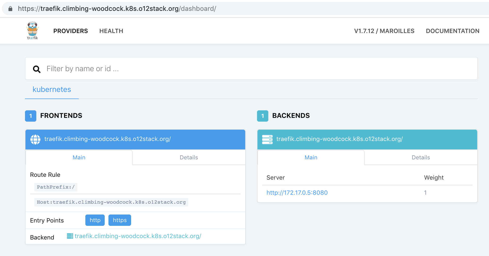

# Workshop cluster setup

This folder holds resources to set up a general workshop 
cluster where:

* Each participant works on it's own server
* The participants edit the relevant workshop files transparently via _SSH/VSCode_ or on the server using _vim/emacs/joe_


Technically, each workshop cluster node:

* is set up (and destroyed) using Terraform
* can be located at any cloud provider Terraform supports (_Hetzner/Digital Ocean/AWS/Azure_ ...)
* is provisioned using _Ansible_
* Each server get's assigned an individual pet name (e.g. `upright-sunbird`)
* Each server gets provisioned a wildcard TLS certficate to ensure secure HTTP communication



## Setting up the cluster

### Weeks before the workshop

We are hosting the servers at [Hetzner](https://accounts.hetzner.com) and DNS for free at [Digital Ocean](https://cloud.digitalocean.com/). So make sure, you have accounts and
API access tokens in place (`HCLOUD_TOKEN` and `DIGITALOCEAN_TOKEN`).

Contact the participants and aks them for their SSH public key.

### The day before the workshop

Prepare your local machine for cluster setup:

```
brew install terraform@0.11 ansible terraform-inventory figlet
brew link terraform@0.11 --force
```

> ⚠️ We need to stick to Terraform 0.11 until [this PR is merged in terraform-inventory](https://github.com/adammck/terraform-inventory/pull/114)!

Set up the server and certificate infrastructure:

```
terraform init
terraform plan
terraform apply
```

Now start provisioning the servers:

```
ansible-playbook site.yml
```

### Workshop day

Assign each participant an individual server. Keys are distributed to all machines, so participants could switch (or share) servers. This will list all available hosts:

    ansible workshop --list-hosts

If you have some late arrivals, adjust the server count in the _Terraform_ file and re-run the steps above. Only the one additional server will be created and provisioned.

### The day after the workshop

Shut down the whole infrastructure using _Terraform_:

```
terraform destroy
```
