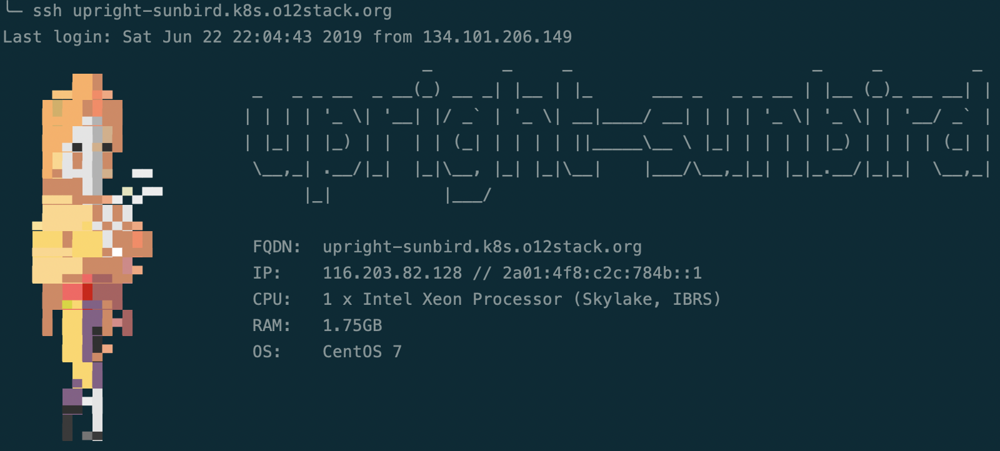

# Workshop cluster setup

This folder holds resources to set up a workshop cluster where

* Each participant can work on it's own server
* The participants can edit the relevant workshop files transparently via SSH/VSCode
* All infrastructure is set up (and destroyed) using Terraform
* All servers are provisioned using Ansible



## Accounts and Tokens needed

* Hetzner
* Digital Ocean

## Prerequisites

Install this on your local machine:

```
brew install terraform@0.11 ansible terraform-inventory
brew link terraform@0.11 --force
```

> We need to stick to Terraform 0.11 until this PR is merged in [terraform-inventory](https://github.com/adammck/terraform-inventory/pull/114)
