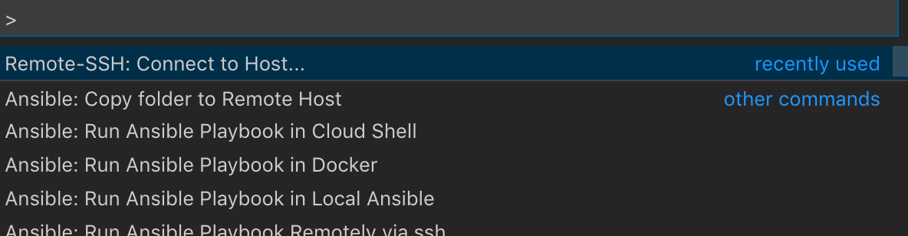
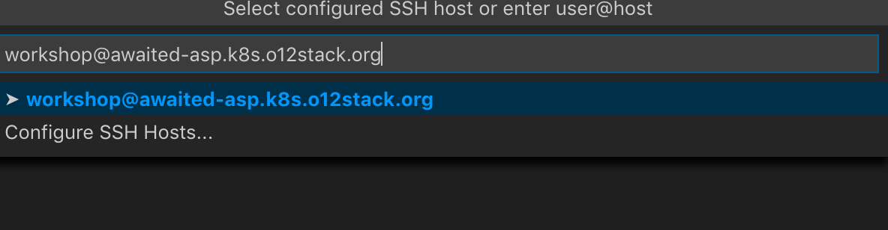
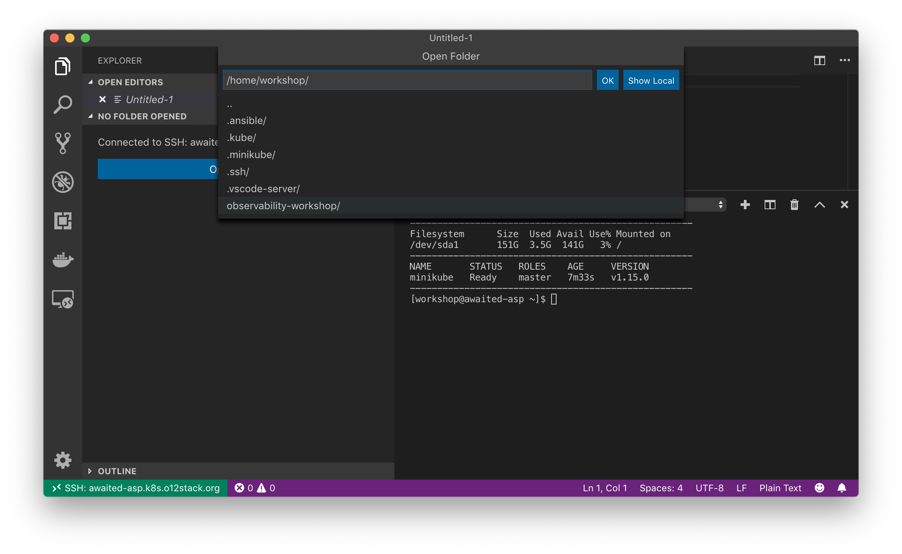

# Generic workshop cluster setup

This repository holds resources to set up a general workshop 
cluster. Letting workshop participants work on unified and equally
powerful servers without any in-workshop software installment hassle
is the goal of this project. For the participants, configuring services on the server on
the other hand should be as transparent as possible.

Upon setup, participants

* work on their own server in e.g. Hetzner or Digital Ocean cloud
* edit the workshop files on their laptop transparently via _SSH/VSCode_ (or directly on the server using _vim/emacs/joe_)
* install, configure and launch workshop related software

> The current setup is meant to be used in a Kubernetes Observability Workshop at W-JAX 2019. A more general approach will move to it's own GitHub repo soon.

## Documentation

* [Technical foundatations](docs/technical_foundations.md)
* [Customizing the Cluster for your workshop](docs/customizing_for_your_workshop.md)
* [Setting up the Cluster](docs/setting_up_the_cluster.md)

## Connecting to the server using VSCode

To connect to your Kubernetes training cluster, we recommend using Visual 
Studio Code and the remote SSH plugin. Hit `F1` and start typing 
`Remote SSH`. Select `Remote SSH: Connect to Host ...`

During the workshop, you connect as the SSH user `workshop`. Connect
to your assigned server, e.g. `workshop@opawaited-asp.k8s.o12stack.org`. 

VSCode opens a remote SSH shell for your convenience. Click `Open a folder`
and select `/home/workshop/observability-workshop` to gain access to the
workshops resources.

